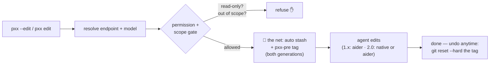

# Build a temperature-converter CLI with pxx — a hands-on tour (v2, dual-flavor)

You're going to build one small, real, tested thing — a temperature-converter CLI — starting from a
buggy stub and finishing with a tool you can actually run. Along the way you'll learn to drive
**pxx**: an AI coding agent that runs on *your own* model (local Ollama, a vLLM box on your LAN, any
OpenAI-compatible endpoint), keeps itself **read-only until you say otherwise**, fences edits to a
folder you choose — and you'll learn the one-command undo net that makes it safe to hand an agent
real code.

**This tutorial works with both generations of pxx.** Wherever they differ, commands appear twice:

> **1.x** — pxx 1.3.x stable, the flag CLI (`pxx --edit …`)
> **2.0** — pxx 2.0, the subcommand CLI (`pxx edit …`)

If you only have one installed, follow your column and skim the other — the *concepts* are the same
tool. Running both side-by-side? Keep 2.0 as your `uv tool install` and pin 1.x in its own venv
(`pip install "pxx-orchestrator==1.3.3.post1"`), shimming one of them under another name (e.g.
`pxx1`) — and keep their state apart (see the Level 0 safety note).

**Your target** (keep this in view — it's what every level builds toward):

```
$ pytest -q                     # all 6 tests green
$ python converter.py 100 C F   # 212.0
```

You start at **0 / 6 tests passing**. Each level teaches one pxx skill *and* moves the scoreboard.
~25 minutes. By the end you'll have built a working tool — and trust that the agent never got out of
your control.

> **How to read this.** Follow the levels in order on the sandbox we scaffold in Level 0. Skippable
> callouts let you go as deep as you want: 🟢 **New to this** · 🔵 **From aider** · 🟣 **Go deeper** ·
> ⚠️ **Safety** (read these).

> ### ⏩ Fast track (comfortable with aider + the terminal?)
> Scaffold (Level 0), then:
> **1.x**: `pxx --edit -m "fix celsius_to_fahrenheit"` → `pxx --edit --scope . -m "implement
> fahrenheit_to_celsius"` → `pxx --review` → `pxx --edit --scope . -m "implement convert() and a CLI in main()"`
> **2.0**: `pxx edit -m "fix celsius_to_fahrenheit"` → `pxx edit --scope . -m "implement
> fahrenheit_to_celsius"` → (review: Level 5) → `pxx edit --scope . -m "implement convert() and a CLI in main()"`
> The only three things to actually read: **Level 2 (how it picks your model)**, **Level 3 (the
> safety net — automatic on both generations)**, and **Level 6½ if you're on 2.0** (the autonomous loop).

---

## What actually happens when you ask pxx to edit

Keep this picture in your head — every level below is one piece of it:



The two ideas that make pxx *safe* are the gate (**D** — it won't act read-only or out of scope) and
the net (**F** — a known-good point you can always rewind to). You'll feel both in Level 3. The one
net is automatic on both generations — the difference is visibility: 2.0 names it in the run
summary (`[net: pxx-pre/…]`), and its aider mode also auto-reverts a blocked out-of-scope run.

---

## Level 0 — Get the sandbox (your starting line: 0 / 6)

Install pxx, then scaffold the throwaway project. The scaffold is identical for both generations:

```sh
# --- install ONE of these ---
uv tool install pxx-orchestrator                    # 2.0 (current), command `pxx`
# still on the 1.x line?  pip install "pxx-orchestrator==1.3.3.post1"

uv tool install pytest                              # the tutorial scores you with pytest
bash setup-pxx-quickstart.sh && cd pxx-quickstart
pytest -q
```
You'll see your starting line — six failing tests:
```
FAILED test_converter.py::test_c2f_freezing - assert 0.0 == 32
FAILED test_converter.py::test_c2f_boiling - assert 180.0 == 212
FAILED test_converter.py::test_f2c - NotImplementedError
FAILED test_converter.py::test_convert_c_to_f - NotImplementedError
FAILED test_converter.py::test_convert_f_to_c - NotImplementedError
FAILED test_converter.py::test_cli_c_to_f - AssertionError: assert '' == '212.0'
6 failed in 0.03s
```
> 🟢 **New to this** pxx needs **Python 3.11+** (1.x: 3.11 or 3.12) and a running model endpoint —
> easiest is [Ollama](https://ollama.com): `ollama pull qwen2.5-coder:7b` (you'll also need pytest,
> installed above). `converter.py` has one real bug and two unwritten functions; those six red tests
> are your to-do list. **Scoreboard: 0 / 6.**
> ⚠️ **Running both generations?** Keep their state apart *before* 2.0's first run — 2.0 migrates a
> 1.x `~/.pxx/memory.db` aside on sight. Point 2.0 at its own home: `PXX_MEMORY_DIR=~/.pxx2`.

---

## Level 1 — Meet pxx read-only (it literally can't touch your code)

Before changing anything, ask pxx to explain what you're building:

```sh
pxx -m "What does converter.py do, and what's incomplete?"        # works on BOTH
# 2.0 spells it `pxx ask -m "…"` — the bare form is rewritten to that for you
```

**1.x** prints its banner and the key word is `mode=ask`:
```
pxx: endpoint=ollama_localhost (http://localhost:11434)  backend=ollama  model=<your-model>  mode=ask (read-only — pass --edit to allow changes)
```
**2.0** keeps the same default: `ask` mode reads and answers, nothing more.

Read-only is the whole point: plain `pxx` **cannot change a file, run a command, or commit** — it
only reads and answers. Run it on any repo, anywhere, with zero risk.

> ✅ **Checkpoint** pxx explained the code and changed *nothing* (`git status` is clean — the sandbox
> ships a `.gitignore` for the agent's cache files). Scoreboard still 0 / 6 — on purpose.
> 🔵 **From aider** This is the big flip: `aider` can edit the moment it starts; pxx makes you opt in.
> On 1.x your aider habits still work — unknown flags forward to aider. On 2.0 they forward **only**
> when the aider backend is active, with a deprecation warning; prefer the native flags.

---

## Level 2 — Point pxx at your model (offline, bring-your-own)

Both generations run fully offline against whatever endpoint you have — but they *find* it
differently:

**1.x — detection.** It probes for a model and picks the first that answers (1s/probe):
`PXX_OLLAMA_BASE` → your vLLM URLs in `PXX_VLLM_URL` → local Ollama (`http://localhost:11434`).
Machine defaults live in `~/.config/pxx/env`.

**2.0 — declaration.** No probe loop: you *say* which model, and list fallbacks it may try in order
if the endpoint is unreachable:
```toml
# ~/.config/pxx/config.toml  (or per-project pxx.toml)
model = "qwen2.5-coder:7b"          # provider defaults to ollama at localhost:11434
# [[fallback_models]] blocks add an explicit fallback chain
```

**Both** honor a one-run override — this is the portable habit:
```sh
PXX_MODEL=qwen2.5-coder:14b pxx -m "…"     # force a model for one run (1.x AND 2.0)
```

> 🟣 **Go deeper** On 2.0 also: `--model`, `--provider ollama|vllm|openai|openai-compatible`,
> `--base-url`, or `PXX_BASE_URL`/`PXX_PROVIDER`. Note `PXX_VLLM_URL` is **1.x-only** — on 2.0 a
> vLLM box is `provider = "vllm"` + `base_url`. 🟢 **New to this** an "endpoint" is just the URL
> your model listens on; pxx works fully offline as long as one answers.

---

## Level 3 — Fix the core, and learn the safety net ⚠️ (→ 2 / 6)

Now let pxx write code. **Both generations tie the net for you** before any edit-capable session
touches a git repo: uncommitted work is stashed automatically, and the starting commit is tagged
(`pxx-pre/<ts>`). On 2.0 the banner says so — watch for `[net: pxx-pre/…]` (with `+stash` when you
had uncommitted work). *(2.0 note: the net landed after `2.0.0rc1`; on rc1 tie it yourself —
`git tag pre-pxx` — exactly as this tutorial taught before the net returned.)*

Tie it by hand once anyway — one command each, and you'll trust the automatic one forever:

```sh
git add -A && git stash push -m "my work before the pxx session"   # only if `git status` is dirty
git tag pre-pxx                                                    # the rewind point (takes 1 second)
```

Then fix the first bug:

```sh
pxx --edit -m "Fix celsius_to_fahrenheit — it's missing the + 32"     # 1.x
pxx  edit  -m "Fix celsius_to_fahrenheit — it's missing the + 32"     # 2.0
pytest -q        # test_c2f_freezing and test_c2f_boiling now PASS  →  2 / 6 🎉
```
> 🟢 **New to this** With a smaller model, pxx may first reply *"please add converter.py
> to the chat"* and make the fix on its next turn — that's normal; it converges. With a *stronger*
> model the opposite happens: asked for a one-line fix, it may implement the whole file and your
> scoreboard jumps past 2 / 6 (live runs with Qwen3-Coder did exactly this). Also fine — the levels
> teach the skills, not exact test counts, and the undo drill below works regardless.
> ⚠️ On a machine where 1.x has *trusted-paths* configured, a sandbox outside those paths is
> hard-refused — add `--anywhere` to the 1.x edit commands (the banner announces it), or scaffold
> under a trusted prefix.

You just moved the scoreboard with an AI agent. Now the part that earns your trust — **break it and
get it back.**

**Undo the whole session.**

**1.x** tagged its own start point (on top of your `pre-pxx`), and aider committed the edit:
```sh
git tag                          # pre-pxx  AND  pxx-pre/<ts>  ← pxx's automatic tag
git reset --hard pxx-pre/<ts>    # (or your own pre-pxx — same place)
pytest -q                        # back to 6 failing — the edit is gone, cleanly
```

**2.0** does *not* auto-tag or auto-stash — that's why you tied the net. And its **native backend
doesn't commit**, so your undo depends on which backend ran:
```sh
git status --short               # edit still uncommitted? (native backend) → discard it:
git restore .                    #   back to 6 failing
git log --oneline                # edit was committed? (aider backend) → rewind to your tag:
git reset --hard pre-pxx
```
Redo the edit afterward to get back to 2 / 6. **You can always undo an agent session** — on 1.x
because pxx nets you, on 2.0 because *you* net you. Same one command either way.

> ⚠️ **The net, in full.** If your tree had *uncommitted* work when the session started: 1.x
> **stashes it automatically** (`git stash list` shows `pxx-pre/<ts>: working state at session
> start`; `git stash pop` restores it). 2.0 does not — which is exactly what the manual
> `git stash push` at the top of this level was for. **Two commands to remember, both generations:**
> `git stash pop` restores your *uncommitted* work; `git reset --hard <tag>` rewinds the *session*.
> Nothing is ever lost; it's one command away.
> 🔵 **From aider** raw aider auto-commits with no net. 1.x wraps every edit in stash-and-tag; 2.0
> traded the auto-net for an in-process permission/scope gate — belt for suspenders. Keep tying the
> manual net on 2.0 until (unless) it grows one back.

> ✅ **Checkpoint** You fixed a bug (2 / 6), undid the entire session, and restored stashed work. That
> undo-and-recover muscle is the whole reason pxx is safe to hand real code.

---

## Level 4 — Grow the tool, fenced to where you're working (→ 3 / 6)

Implement the next function, and keep the agent boxed in. Same flag, both generations:

```sh
pxx --edit --scope . -m "Implement fahrenheit_to_celsius: (f - 32) * 5 / 9"   # 1.x
pxx  edit  --scope . -m "Implement fahrenheit_to_celsius: (f - 32) * 5 / 9"   # 2.0
pytest -q        # test_f2c now PASSES  →  3 / 6
```
> ⚠️ **2.0-native habit: commit each level before the next.** The net stashes *any* uncommitted
> work at session start — and since the native backend doesn't commit for you, that includes the
> previous level's progress. `git add -A && git commit -m "level 3"` after each green checkpoint
> keeps the scoreboard compounding (the banner's `+stash` tells you when the net parked something;
> `git stash pop` gets it back).

`--scope` fences edits to a path prefix. The default writable area is the repo root — `--scope`
narrows it. But **the fence is built differently**, and it matters:

- **1.x** enforces scope by *instructing the model* (a scope-directive file is injected into the
  session). A well-behaved model refuses out-of-scope edits; a headstrong one can ignore it — in
  live validation, Qwen3-Coder edited `converter.py` right through `--scope other_dir`, and aider
  committed it. Treat 1.x scope as a guardrail, not a wall; the *wall* in 1.x is trusted-paths.
- **2.0 native backend** enforces scope *mechanically*: every file change passes through the
  in-process gate before it happens.
- **2.0 aider backend** detects *and reverts*: aider runs as a subprocess with repo access, so an
  out-of-scope commit can momentarily land — pxx's post-capture then reports `[OUT_OF_SCOPE]`
  (exit 2) naming the paths, **rewinds the blocked run's commits** (`reverted to <sha>` in the
  summary), and removes session-created out-of-scope droppings. Verified live: the same attempt
  that once left a 22-line commit behind now leaves `git log` untouched. (Your stash, if the net
  parked one, is never popped by pxx — restoring it stays your move.)

Try it yourself: `pxx edit --scope other_dir -m "Add a comment to converter.py"` and check
`git status --short` after, on each generation.

> 🟣 **Go deeper** For sensitive setups, both support a *trusted-paths* hard-block outside an
> allowlist. 1.x: `~/.config/pxx/trusted-paths`, with `--anywhere` as a banner-announced one-run
> escape. 2.0: `trusted_paths` in config — **no `--anywhere` flag**; widening the fence is a config
> edit, on purpose. 🟢 **New to this** "scope" = the folder(s) the agent may modify; everything else
> is look-but-don't-touch.
> ✅ **Checkpoint** Scoreboard moved, and you know which generation's fence is advisory (1.x) and
> which is mechanical (2.0) — and to verify with `git status`, not the agent's summary.

---

## Level 5 — Get a second opinion on what changed

A safe way to sanity-check an agent's work before you build on it — this is where the generations
diverge most:

**1.x** has a dedicated read-only review pass over your latest diff:
```sh
pxx --review
```
> ⚠️ **First time?** `--review` uses a *reviewer* model, `PXX_REVIEW_MODEL` (default
> `qwen2.5:7b-instruct`). If you only pulled `qwen2.5-coder:7b`, point the reviewer at it:
> `PXX_REVIEW_MODEL=qwen2.5-coder:7b pxx --review` — otherwise the review fails closed.

**2.0** has no standalone review command — review became a **fail-closed gate inside the loop**
(you'll meet it in Level 6½: a reviewer model inspects every round and can block promotion). For a
one-off second opinion between edits, use read-only ask on the diff:
```sh
{ echo "Review this diff for correctness and edge cases:"; git diff --no-prefix pre-pxx; } | pxx ask
```
Two pitfalls, both found the hard way: don't combine a pipe with `-m` — when `-m` is present, 2.0
ignores stdin entirely, so the diff would never reach the model. And use `--no-prefix` — 2.0's
preflight reads file references in the prompt, and git's default `a/converter.py` prefix makes it
fail closed asking which file you meant.

> ✅ **Checkpoint** You got a model's assessment of the `fahrenheit_to_celsius` change — via
> `--review` (1.x) or a read-only ask over the diff (2.0).

---

## Level 6 — Let pxx finish the job (→ 6 / 6, and a working CLI)

Two functions left (`convert` and the CLI `main`). Re-tie your net (`git tag -f pre-pxx`), then hand
both to pxx in one scoped edit:

```sh
pxx --edit --scope . -m "Implement convert() to dispatch C/F, and main() so 'python converter.py 100 C F' prints exactly 212.0 — just the number, nothing else"   # 1.x
pxx  edit  --scope . -m "Implement convert() to dispatch C/F, and main() so 'python converter.py 100 C F' prints exactly 212.0 — just the number, nothing else"   # 2.0
```
(Be that precise on purpose: prompted with just "prints the result", live models printed
`100.0°C = 212.0°F` — friendly, but the CLI test wants `212.0` and stays red. When that happens,
one more edit citing the failing test fixes it — agents converge on tests, not vibes.)
pxx makes the change behind the scope gate + your net. Then:
```sh
pytest -q                        # 6 passed  →  6 / 6 ✅
python converter.py 100 C F      # 212.0     ← you built a working CLI
```
> ✅ **Checkpoint** All tests green and `python converter.py 100 C F` → `212.0`. **You built it.**
> (On 2.0's native backend the changes are uncommitted — `git add -A && git commit` when you're
> happy; you own the history.)

---

## Level 6½ — 2.0 only: hands-off, test-gated iteration

This is the payoff that made 2.0 worth a rewrite. On 1.x, `--loop` is experimental and refuses to
run anywhere but inside the pxx repo itself. **2.0's loop runs in any repo** — it just needs to know
how to score itself, and the sandbox's `pxx.toml` already told it (`test_command = "pytest -q"`).

> ⚠️ **Endpoint requirement.** The loop (and 2.0's native backend generally) drives the model
> through **tool calling**. An Ollama endpoint handles this out of the box; a vLLM server must be
> launched with `--enable-auto-tool-choice --tool-call-parser <parser>` (for Qwen3-Coder, vLLM
> ships a matching parser) or every round fails closed with `MODEL_UNAVAILABLE` and an HTTP 400
> about tool choice. `ask`/`edit` sidestep this when the aider backend is active; `loop` does not.

Prove it end-to-end: rewind the whole build and let the loop do Levels 3–6 alone:

```sh
git reset --hard pre-pxx                 # back to 0 / 6 (yes, really — the net again)
pxx loop -m "Make all six tests pass" --scope .
pytest -q                                # watch it come back: 6 / 6, hands off
```

The loop runs bounded rounds of edit → test → review → repair, under the same scope gate and
budgets (`--budget-rounds` caps it), with the Level 5 review gate deciding fail-closed whether a
round's work stands. This is the flow to compare against a 1.x baseline: same sandbox, same
scoreboard, no human between rounds.

> 🟣 **Go deeper** `pxx runs list` / `pxx runs show` inspect what each round did; `pxx metrics
> export` pulls tokens/rounds/wall-clock for A/B comparisons; `pxx audit verify` proves the
> hash-chained audit log wasn't touched. Pin `--backend native` if aider is also installed and you
> want to measure pxx 2.0 itself rather than its aider passthrough.

---

## Level 7 — Teach it your conventions (optional)

As a project grows, let pxx remember decisions across sessions:

**1.x** — memory is opt-in per run, with in-session slash commands:
```sh
pxx --with-memory -m "…"
#  in-session:  /remember "temperatures are floats; round only at display"    /recall "rounding"
```

**2.0** — memory is in-process and **on by default** (`--no-memory` to opt out); you manage it with
subcommands instead of slash commands:
```sh
pxx memory add "temperatures are floats; round only at display"
pxx memory search "round"
pxx memory list        # …and `forget` / `gc` to prune
```
Two things live runs taught: memory is **project-scoped by working directory** — run these from the
project the note belongs to, or `search`/`list` come back empty. And search matches exact tokens
(no stemming): `"round"` finds the note above; `"rounding"` doesn't.

Memory is **context, never a command** — it informs the agent, it doesn't control it. Safe to skip
on day one.

---

## 🏁 You shipped it — now do one on your own (capstone)

You built a tested converter CLI with an AI agent you kept on a leash the entire time: read-only by
default, fenced by scope, undoable via the tag. Now cement it with **less hand-holding**:

> **Capstone — add Kelvin.** Make `convert` handle `"K"` too (0°C = 273.15 K), add two tests first,
> then let pxx make them pass. Use what you learned: start read-only to plan, a scoped edit to
> build, a review to check, and your `pre-pxx` tag if a round goes sideways. On 2.0, try doing the
> whole capstone with one `pxx loop` — the two new tests make the scoreboard 8/8. Target:
> `python converter.py 0 C K` → `273.15`.

---

## Cheat sheet

| You want to… | 1.x (stable) | 2.0 (ng) |
|---|---|---|
| Ask about code, change nothing | `pxx -m "…"` | `pxx ask -m "…"` (bare `pxx -m` still works) |
| Make a change, fenced to a folder | `pxx --edit --scope <dir> -m "…"` | `pxx edit --scope <dir> -m "…"` |
| Tie the safety net | automatic (stash + `pxx-pre/<ts>` tag) | automatic too (`[net: …]` in the summary; rc1: manual `git tag pre-pxx`) |
| Undo a session | `git reset --hard pxx-pre/<ts>` | `git restore .` (native, uncommitted) or `git reset --hard pre-pxx` |
| Second opinion on a change | `pxx --review` | `{ echo "review this:"; git diff --no-prefix pre-pxx; } \| pxx ask` |
| Hands-off iteration | `--loop` (pxx repo only) | `pxx loop -m "…" --scope <dir>` — any repo, needs `test_command` |
| Health check · update | `pxx --doctor` · `pxx --upgrade` | `pxx doctor` · `pxx upgrade` |
| Memory | `--with-memory` + `/remember` `/recall` | on by default · `pxx memory add/search/list/forget` |

**The model in one line:** *pxx picks your local model, gates on permission + scope, keeps a rewind
point (1.x ties it, on 2.0 you do), and only edits when you opt in — same leash, two spellings.*

---

## Appendix — power users & contributors

- **Dogfooding.** 1.x: `pxx --self-test` / `--self-lint` / `--self-improve` / `--self-fix`.
  2.0: plain `uv run pytest` / `uv run ruff check` (the legacy flags map to `pxx run` with a
  deprecation notice); the self-improvement machinery moved to `pxx improve` (evidence-gated,
  see the project docs).
- **Headless.** Both: `-m "…"` on a non-TTY auto-confirms (scripts/cron). 2.0 adds `pxx serve`
  (API) and `pxx mcp` (expose memory over MCP).
- **Configs.** 1.x: `config/aider.conf.yml`, `config/model-settings.yml`, `pxx/prompts/system.md`.
  2.0: layered TOML — CLI > `PXX_*` env > `./pxx.toml` or `./.pxx/config.toml` >
  `~/.config/pxx/config.toml` > defaults; unknown keys fail loud. Aider-backend users port custom
  aider settings to `~/.aider.conf.yml` (2.0 no longer injects 1.x's config files).
- **Not covered (advanced).** 1.x: the optional 9router/agentmemory services (gone in 2.0 —
  in-process now). 2.0: `agents`, `improve`, `goal`, `workflow`, `channels` — see the project docs.

Welcome to pxx. Start read-only, scope your edits, and let the safety tag do the worrying —
whichever generation ties it.
