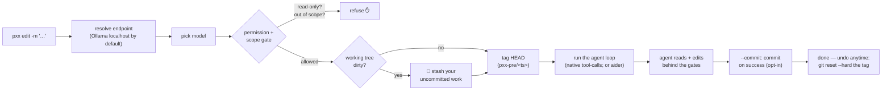

# Build a temperature-converter CLI with pxx — a hands-on tour

You're going to build one small, real, tested thing — a temperature-converter CLI — starting from a
buggy stub and finishing with a tool you can actually run. Along the way you'll learn to drive
**pxx**: an AI coding agent that runs on *your own* model (local Ollama, a vLLM box on your LAN, any
OpenAI-compatible endpoint), keeps itself **read-only until you say otherwise**, fences edits to a
folder you choose, and drops a one-command undo net before it touches anything.

**Your target** (keep this in view — it's what every level builds toward):

```
$ pytest -q                     # all 6 tests green
$ python converter.py 100 C F   # 212.0
```

You start at **0 / 6 tests passing**. Each level teaches one pxx skill *and* moves the scoreboard.
~25 minutes. By the end you'll have built a working tool — and trust that the agent never got out of
your control.

> **How to read this.** Follow the levels in order on the sandbox we scaffold in Level 0. Skippable
> callouts let you go as deep as you want: 🟢 **New to this** · 🔵 **From aider** · 🟣 **Go deeper** ·
> ⚠️ **Safety** (read these).

> ### ⏩ Fast track (comfortable with agents + the terminal?)
> `bash setup-pxx-quickstart.sh` → `uv tool install --python 3.12 pxx-orchestrator` →
> `uv tool install pytest` → `pxx edit --commit -m "fix celsius_to_fahrenheit"` →
> `pxx edit --commit --scope . -m "implement fahrenheit_to_celsius"` → `pxx review` →
> `pxx edit --commit --scope . -m "implement convert() and a CLI in main()"`.
> The only two things pxx changes for you are **Level 2 (how it picks your model)** and **Level 3
> (the safety net)** — read those two, skim the rest.

---

## What actually happens when you run `pxx edit`

Keep this picture in your head — every level below is one piece of it:


```mermaid
flowchart LR
    A["pxx edit -m '…'"] --> B["resolve endpoint<br/>(Ollama localhost by default)"]
    B --> C["pick model"]
    C --> D{"permission +<br/>scope gate"}
    D -->|"read-only?<br/>out of scope?"| X["refuse ✋"]
    D -->|allowed| E{"working tree<br/>dirty?"}
    E -->|yes| F["🛟 stash your<br/>uncommitted work"]
    E -->|no| T
    F --> T["tag HEAD<br/>(pxx-pre/&lt;ts&gt;)"]
    T --> G["run the agent loop<br/>(native tool-calls; or aider)"]
    G --> H["agent reads + edits<br/>behind the gates"]
    H --> I["--commit: commit<br/>on success (opt-in)"]
    I --> Z["done — undo anytime:<br/>git reset --hard the tag"]
```

The two ideas that make pxx *safe* are the gate (**D** — it won't act read-only or out of scope) and
the net (**F** — your work is stashed and the start is tagged). You'll feel both in Level 3.

---

## Level 0 — Get the sandbox (your starting line: 0 / 6)

Install pxx, then scaffold the throwaway project:

```sh
uv tool install --python 3.12 pxx-orchestrator   # the command is `pxx` (2.x)
uv tool install pytest                           # the tutorial scores you with pytest
curl -fsSLO https://raw.githubusercontent.com/cdnwetzel/pxx/v2/scripts/setup-pxx-quickstart.sh
bash setup-pxx-quickstart.sh && cd pxx-quickstart
pytest -q
```
You'll see your starting line — six failing tests:
```
FAILED test_converter.py::test_c2f_freezing - assert 0.0 == 32
FAILED test_converter.py::test_c2f_boiling - assert 180.0 == 212
FAILED test_converter.py::test_f2c - NotImplementedError
FAILED test_converter.py::test_convert_c_to_f - NotImplementedError
FAILED test_converter.py::test_convert_f_to_c - NotImplementedError
FAILED test_converter.py::test_cli_c_to_f - AssertionError: assert '' == '212.0'
6 failed in 0.03s
```

**Now pick a model that matches your RAM.** pxx needs **Python 3.11+** and a running model endpoint —
easiest is [Ollama](https://ollama.com):

```sh
# 16GB+ RAM — the default works out of the box:
ollama pull qwen2.5-coder:7b

# 8GB RAM — use the non-thinking qwen3 instruct with a capped context window
# (write the Modelfile OUTSIDE the sandbox so `git status` stays clean):
ollama pull qwen3:4b-instruct-2507-q4_K_M
printf 'FROM qwen3:4b-instruct-2507-q4_K_M\nPARAMETER num_ctx 8192\nPARAMETER temperature 0.2\n' > ../Modelfile.qwen3
ollama create qwen3:4b-instruct-8k -f ../Modelfile.qwen3
export PXX_MODEL=qwen3:4b-instruct-8k            # put it in ~/.config/pxx/env to make it stick
```

> ⚠️ **Why these exact choices on 8GB — each line prevents a real failure mode.**
> pxx's built-in agent drives the model with *structured tool calls*; models that can't emit them
> (e.g. qwen2.5-coder at 3B and below) narrate JSON as text and your edits **silently no-op**.
> "Thinking" models (plain `qwen3:4b`) re-enter thinking after every tool result and can spend
> many minutes per step — the `-instruct-2507` tag doesn't think. `num_ctx 8192` matters twice:
> Ollama's 4096 default silently truncates the agent's tool schemas mid-session (symptom: the agent
> suddenly "describes" edits instead of making them), while oversized values balloon memory — the
> KV cache scales with `num_ctx`, and at 16k this model occupies ~4GB of an 8GB machine. The low
> temperature keeps tool-call syntax stable.
> 🟢 **New to this** `converter.py` has one real bug and two unwritten functions; those six red
> tests are your to-do list. **Scoreboard: 0 / 6.**

---

## Level 1 — Meet pxx read-only (it literally can't touch your code)

Before changing anything, ask pxx to explain what you're building:

```sh
pxx ask -m "What does converter.py do, and what's incomplete?"
```

`ask` is the whole point of pxx's design: it **cannot change a file or commit** — it only reads and
answers (the session summary line ends `(rounds=… tokens=… diff_lines=0)` — that last number is the
proof). Run it on any repo, anywhere, with zero risk.

> ✅ **Checkpoint** pxx explained the code and changed *nothing* (`git status` is clean — the sandbox
> ships a `.gitignore` for agent cache files). Scoreboard still 0 / 6 — on purpose.
> 🔵 **From aider** This is the big flip: `aider` can edit the moment it starts; pxx makes you opt
> in with the `edit` verb. If you have aider installed, pxx will use it as the engine by default —
> pass `--backend native` to use pxx's own built-in agent loop instead (what this tutorial assumes).

---

## Level 2 — Point pxx at your model (offline, bring-your-own)

pxx talks to your local Ollama at `http://localhost:11434` by default. Nothing leaves your machine.

```sh
PXX_MODEL=qwen2.5-coder:7b pxx ask -m "…"     # force a model for one run
```
> 🟣 **Go deeper** `PXX_MODEL` picks the model, `PXX_PROVIDER` the *provider* type
> (`ollama` | `openai` | `vllm` | `openai-compatible` — distinct from Level 1's execution
> `--backend`), `PXX_BASE_URL` the endpoint URL. Put machine defaults
> in `~/.config/pxx/env` or `~/.config/pxx/config.toml`. 🟢 **New to this** an "endpoint" is just
> the URL your model listens on; pxx works fully offline as long as one answers.

---

## Level 3 — Fix the core, and learn the safety net ⚠️ (→ 2 / 6)

Now let pxx write code. Fix the first bug:

```sh
pxx edit --commit -m "Fix celsius_to_fahrenheit — it's missing the + 32"
pytest -q        # test_c2f_freezing and test_c2f_boiling now PASS  →  2 / 6 🎉
```
Real output from this exact command (qwen3:4b-instruct-8k on an 8GB MacBook):
```
[COMPLETED] I've successfully fixed the celsius_to_fahrenheit function by adding the +32 as
required. The change was made directly in the converter.py file.
…
The function now properly converts Celsius to Fahrenheit using the correct formula:
F = (C × 9/5) + 32.
[net: pxx-pre/20260725T145823Z+stash] [committed 475a6745] (rounds=5 tokens=10267 diff_lines=2)
```
> 🟢 **New to this** The agent *reads* `converter.py` with a tool call first, then makes a surgical
> edit — that read-then-edit rhythm is normal and is the agent working exactly as designed. Decode
> the last line: the net tag you can rewind to, the commit `--commit` made for you, and
> `diff_lines=2` — the whole session changed two lines. (That `+stash`? There was an untracked file
> in the tree — the net stashed it. You'll learn exactly what that means below.) One more habit to
> notice: the model may leave the old `# BUG` comment sitting on the line it just fixed — agents fix
> what you ask for, not what you didn't. Deleting stale comments is still your job.

You just moved the scoreboard with an AI agent. Now the part that earns your trust — **break it and
get it back.**

**Undo the whole session.** pxx tagged the commit it started from:
```sh
git tag                      # pxx-pre/<ts>   ← the safety tag pxx created
git reset --hard pxx-pre/<ts>
pytest -q                    # back to 6 failing — the edit is gone, cleanly
```
Redo it (`pxx edit --commit -m "…"` again) to get back to 2 / 6. **You can always undo an agent
session.**

⚠️ **The net, in full.** If your tree had *uncommitted* work when you ran `edit`, pxx **stashes it**
first so the agent starts clean (the summary shows `[net: pxx-pre/<ts>+stash]`). Prove it to
yourself (plain git — this is exactly what pxx does):
```sh
echo "# my notes" >> converter.py        # pretend you had unsaved work
git status --short                        #  M converter.py

git stash push --include-untracked -m "pxx safety net <run-id>"
git status --short                        # (empty) ← clean; your work is safe in the stash
git stash list                            # stash@{0}: On main: pxx safety net <run-id>
git stash pop                             #  M converter.py  ← your work is back
```
> ⚠️ **Remember two commands:** `git stash pop` restores your *uncommitted* work; `git reset --hard
> <tag>` rewinds the *session's* changes. And this is why the tutorial always passes `--commit`:
> without it your green level sits *uncommitted*, and your **next** pxx session will stash it away —
> the scoreboard "mysteriously" regresses until you `git stash pop`. Commit each green level (pxx
> does it for you with `--commit`), and nothing is ever more than one command away.
> 🔵 **From aider** raw aider auto-commits with no net; pxx wraps every edit in this stash-and-tag
> and makes the commit itself opt-in.

> ✅ **Checkpoint** You fixed a bug (2 / 6), undid the entire session, and restored stashed work. That
> undo-and-recover muscle is the whole reason pxx is safe to hand real code.

---

## Level 4 — Grow the tool, fenced to where you're working (→ 3 / 6)

Implement the next function, and keep the agent boxed in:

```sh
pxx edit --commit --scope . -m "Implement fahrenheit_to_celsius: (f - 32) * 5 / 9"
pytest -q        # test_f2c now PASSES  →  3 / 6
```
`--scope` fences edits to a path prefix; try `--scope some_other_dir` and pxx will *refuse* to touch
`converter.py`. The default writable area is the repo root — `--scope` narrows it.

> 🟣 **Go deeper** The writable world is: the project root you run in, narrowed by `--scope`, plus
> any extra absolute paths you allow via `trusted_paths` in `~/.config/pxx/config.toml`. Everything
> else raises a scope violation — the agent cannot wander. 🟢 **New to this** "scope" = the
> folder(s) the agent may modify; everything else is look-but-don't-touch.
> ✅ **Checkpoint** 3 / 6, and you saw the scope gate refuse an out-of-bounds edit.

---

## Level 5 — Get a second opinion on what changed

Reviews in pxx look at your **diff** — so review *before* you commit (or point it at history):

```sh
pxx edit --scope . -m "Implement convert(value, unit_from, unit_to): C→F and F→C dispatch. Change only convert()."   # note: no --commit this time
pxx review                       # read-only: reviews the uncommitted diff, prints verdict + findings
git add -u && git commit -m "convert() dispatch"      # you commit once you're satisfied
pytest -q        # convert tests PASS  →  5 / 6
```
This is the edit → review → commit rhythm you'll use on real code: the agent proposes, a read-only
review critiques (`verdict: APPROVE` or `REVISE`, exit code 2 on REVISE — scriptable), and *you*
decide what enters history.

> 🟣 **Go deeper** `pxx review --staged` reviews staged changes; `pxx review --since <sha>` reviews
> committed history. The reviewer uses the same model you configured — no second model needed.
> 🟢 **New to this** Small models are eager: without the "Change only convert()" fence the agent may
> implement `main()` too and jump you straight to 6 / 6. If that happens, enjoy it — review, commit,
> skip Level 6's edit, and just run its verification lines.
> ✅ **Checkpoint** 5 / 6, and `pxx review` printed a verdict on the `convert()` change.

---

## Level 6 — Let pxx finish the job (→ 6 / 6, and a working CLI)

One function left — the CLI entry point. Hand it over:

```sh
pxx edit --commit --scope . -m "Implement main(argv) so 'python converter.py 100 C F' prints 212.0, using convert()"
pytest -q                        # 6 passed  →  6 / 6 ✅
python converter.py 100 C F      # 212.0     ← you built a working CLI
```
Real output from this exact command (same model and machine as Level 3):
```
[COMPLETED] I've implemented the main() function in converter.py. The function now:
1. Checks if there are exactly 4 arguments (value, unit_from, unit_to)
2. Parses the arguments - the value as a float and the units as strings
…
When running 'python converter.py 100 C F', it will:
- Call convert(100, 'C', 'F')  →  180 + 32 = 212.0  →  Print "212.0"
[net: pxx-pre/20260725T150847Z] [committed 802301cf] (rounds=4 tokens=8949 diff_lines=15)
```
> 🟣 **Go deeper** `pxx loop -m "make the failing tests pass" --scope .` runs bounded autonomous
> rounds (edit → test → review) — in 2.x it works in **any** repo, and it verifies each round with
> your test command (set `PXX_TEST_COMMAND="pytest -q"` or `test_command` in config). It's the
> hands-off version of what you just did by hand; budget-capped so it can't run away. For everyday
> work, `edit` + `review` is the bread and butter.
> ✅ **Checkpoint** All tests green and `python converter.py 100 C F` → `212.0`. **You built it.**

---

## Level 7 — Teach it your conventions (optional)

As a project grows, let pxx remember decisions across sessions (memory is on by default; it's
*context, never a command* — it informs the agent, it doesn't control it):

```sh
pxx memory add "temperatures are floats; round only at display" --tags conventions
pxx memory search "rounding"
pxx memory list
```
Safe to skip on day one.

---

## 🏁 You shipped it — now do one on your own (capstone)

You built a tested converter CLI with an AI agent you kept on a leash the entire time: read-only by
default, fenced by scope, undoable via the tag. Now cement it with **less hand-holding**:

> **Capstone — add Kelvin.** Make `convert` handle `"K"` too (0°C = 273.15 K), add two tests first,
> then let pxx make them pass. Use what you learned: start with `ask` to plan, `edit --commit
> --scope .` to build, `review` to check, and the safety tag if a round goes sideways. Target:
> `python converter.py 0 C K` → `273.15`.

---

## Cheat sheet

| You want to… | Run |
|---|---|
| Ask about code, change nothing | `pxx ask -m "…"` (read-only) |
| Make a change, fenced + committed | `pxx edit --commit --scope <dir> -m "…"` |
| Review a diff before it lands | `pxx review` (uncommitted) · `--staged` · `--since <sha>` |
| Hands-off iteration, budget-capped | `pxx loop -m "<task>" --scope <dir>` (+ `PXX_TEST_COMMAND`) |
| Undo a session | `git reset --hard pxx-pre/<ts>` (then `git stash pop` for pre-session edits) |
| Check your setup · upgrade | `pxx doctor` · `pxx upgrade` |

**The model in one line:** *pxx picks your local model, gates on permission + scope, nets your work,
runs its own tool-calling agent loop — read-only until you opt in.*

---

## Troubleshooting (60 seconds, in order)

1. **Rounds suddenly take minutes, or `MODEL_UNAVAILABLE` on a machine that was fine an hour ago**
   → a stale model server is usually squatting on memory (an upgraded-under-you Ollama can orphan a
   runner holding gigabytes while idle). `brew services restart ollama` (or restart the Ollama app),
   then retry. Also `ollama stop <model>` any models you're not using.
2. **The agent "describes" an edit but `diff_lines=0` and nothing changed** → your model is emitting
   tool calls as prose. Causes, in order of likelihood: context truncation (raise `num_ctx` — see
   Level 0), a model too small for structured tool calls (use the Level 0 recommendations), or
   temperature flakiness (set `PARAMETER temperature 0.2` in your Modelfile).
3. **Your green tests "mysteriously" regressed after a pxx run** → your previous level was
   uncommitted and the safety net stashed it: `git stash pop`, commit, carry on (and use `--commit`).
4. **Slow hardware timing out** → first fix the memory pressure (items 1 and Level 0's sizing);
   pxx releases newer than 2.0.2 can also raise the per-round ceiling with
   `PXX_NATIVE_TIMEOUT=540 pxx edit …` (check `pxx --version`-era release notes).

---

## Appendix — power users & contributors

- **Doctor first:** `pxx doctor` checks Python, config, endpoint reachability, and required binaries
  in one shot.
- **Headless:** `pxx run -m "…"` is the unattended, budget-capped verb (non-TTY auto-confirms).
- **Hygiene:** `pxx check` scans staged files for secrets/PII before they leave your machine;
  `pxx audit verify <path>` verifies the hash-chained audit log of past sessions.
- **Config lives in** `~/.config/pxx/config.toml` (+ `~/.config/pxx/env` for env defaults); the
  `PXX_*` env vars override per-run.
- **Not covered (advanced):** `pxx serve` (REST/SSE), `pxx mcp` (MCP server), workflows, and the
  self-improvement machinery — see the project docs when you're ready.
